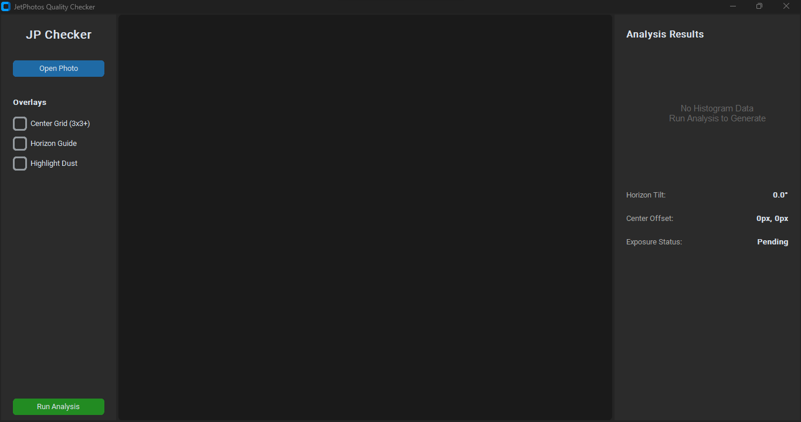
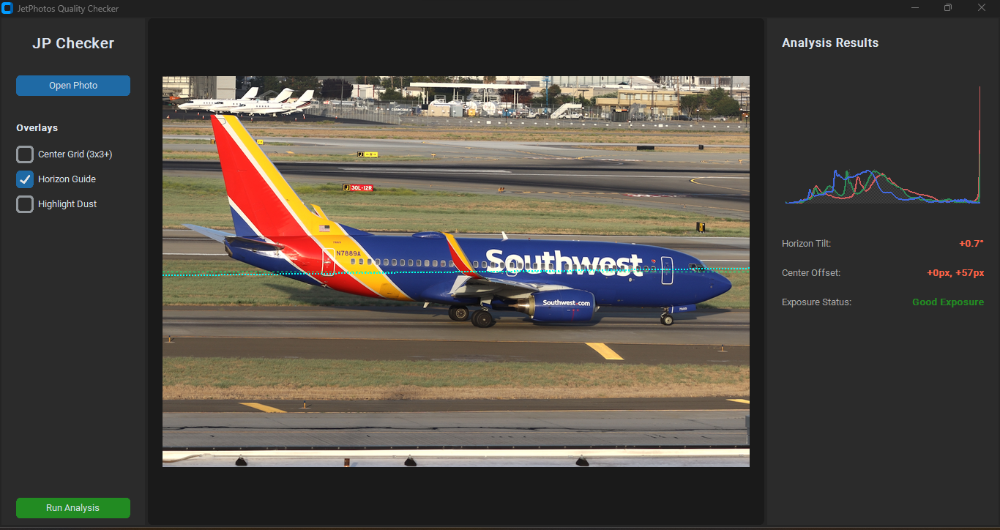
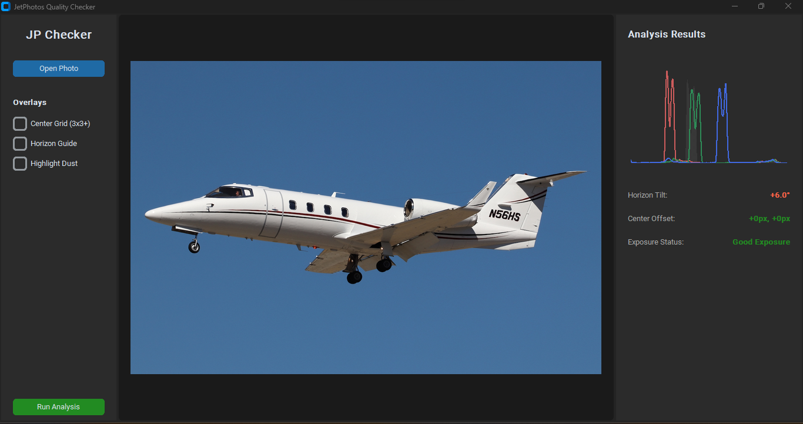

# JetPhotos Quality Checker

A standalone desktop application built entirely in Python designed to help aviation photographers pre-screen their aircraft photos against the strict rejection criteria of JetPhotos.



This tool performs high-performance image telemetry locally in memory, eliminating the need to guess if a photo meets screeners' standards.

## 🚀 Key Features

*   **Center Grid (3x3+ with Subdivisions):** Overlays a standard 3x3 compositional grid, with the absolute center box divided into solid quadrants (2x2 sub-grid). Perfect for verifying that your fuselage or cockpit is dead-center.
*   **Automated Horizon Guide:** Uses Canny Edge Detection and Hough Line Transforms via OpenCV to automatically calculate horizontal lines (runways, taxiways, hills) and estimate background tilt down to a tenth of a degree (`0.0°`). Displays an interactive vector angle guide for quick comparison.



The dashed green line is the horizon line, and the cyan line shows the estimated tilt. When estimating tilt by eye, vertical lines are more reliable.

*   **Sensor Dust Spot Equalizer:** Implements local contrast enhancement (CLAHE filter) and color inversion to simulate the exact screening technique used by reviewers. Hidden dust rings and halos in gradients like blue skies become instantly visible.
*   **Native RGB & Luminance Histogram:** Real-time color channel frequency distribution calculated with OpenCV and rendered natively onto vectors—skipping heavy charting wrappers. It automatically highlights clipping profiles with a dedicated `Exposure Status` readout. Below is an image that got flagged as "borderline dark" with an accompanying histogram.



## 🛠️ Tech Stack & Architecture

*   **GUI Framework:** [CustomTkinter](https://github.com) (Modern, hardware-accelerated dark theme UI wrappers built on Tkinter).
*   **Image Handling Engine:** [Pillow (PIL)](https://python-pillow.org) for aspect-ratio locked workspace rendering.
*   **Mathematical Vector Analytics:** [OpenCV (Python Bindings)](https://opencv.org) for rapid matrix manipulations.
*   **Compatibility:** Native structural support engineered explicitly for **NumPy 2.2+ architectures** (bypassing old NumPy 1.x ABI C-API binding bugs using clean standard floating-point translation blocks).

## 📦 Installation & Setup

1. **Clone the repository:**
   ```bash
   git clone https://github.com/dhong9/jp_quality_checker.git
   cd jp_quality_checker
   ```

2. **Install the required packages:**
   ```bash
   pip install --upgrade numpy pillow customtkinter opencv-python
   ```

3. **Run the application:**
   ```bash
   python app.py
   ```

## 🖥️ Standalone Compilation

If you want to bundle this tool into a standalone executable file (`.exe` or `.app`) that users can open without installing Python, use **PyInstaller**:

```bash
pip install pyinstaller
pyinstaller --noconsole --onefile app.py
```
*Your production file will appear inside the generated `dist/` directory.*

## 📄 License
Distributed under the MIT License. See `LICENSE` for more information.